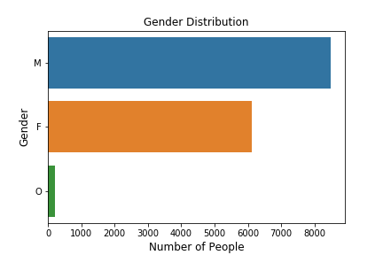
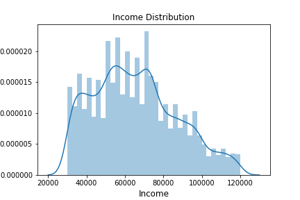
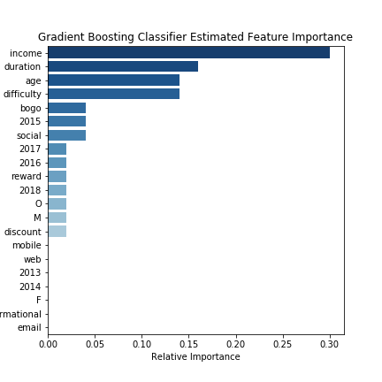

# Predicting customer responsiveness for marketing offers

This project deals with customer reactions for specific marketing offers of starbucks.
The goal is to predict if a specific customer profile is responsive to a certaint type of offer.
For this reason, different datasets where combined and processed. Three different classifiers were trained on the provided data and evaluated based on their performance.

## Feature Analysis
In order to generate valuable insights from the provided datasets, the **CRISP-DM** Methodology (Cross-Industry Standard Process for Data Mining) is applied.
In a first step, the provided data attributes were analysed in an in-depth feature analysis.

The following plot shows the distribution of the provided customer profiles. The majority of the provided customer profiles are males.

The income distribution of the provided customer profiles is shown below. It can be observed, that the majority of incomes are distributed aroun 70'000.

The provided datasets were processed and combined in order to provide an optimized input data set for the classfiers.

## Final Thoughts and whats next?

The objective of the project was to provide accurate predictions if a specific customer profile will successfully react to a specific offer. From the provided data attributes, the income, offer duration, customer age and offer difficulty turned out to be the most important feature for this prediction. Other variables such as gender or member date have only a minor influence.
This can be observed in the plot below.

After defining the business challenge and processing the provided datasets to optimize for the specified prediction problem, the resulting models performed well on the training and test data with an accuracy of around 73%. The Gradient Boosting Classifier outperforms the other algorithms slighlty in terms of mean accuracy and f1-score.
This is a significant improvement compared to a naive classifier which performs around 50%. 

Suggestions for next steps include the collect more data for model training because the given the dataset reduced to only 66'501 rows after processing, a larger training set could improve model performance and robusteness. It will be useful to collect more data before the model is deployed in production.
Furthermore, advanced hyperparameter tuning can be performed by renting more compute resources from a cloud provider and performing GridesearchCV over a larger parameter grid. With more available resources, more sophisticated approaches can also be investigated for hyperparameter tuning such as bayesian optimizers or the covariance matrix adaptation evolution strategy.
After leverage above two steps that ensure a well performing and robust classifier, the trained model can be deployed as a webservice to allow business teams to decide wether an offer should be sent to a specific customer or not.
